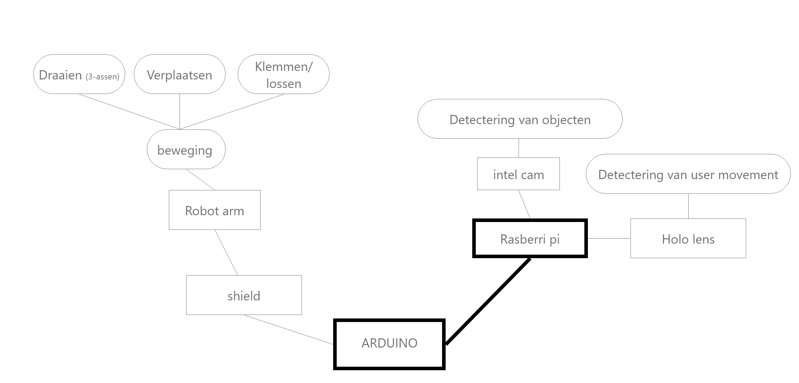

# Analyse

## Probleemstelling

### Hoofdprobleem
We willen een robotarm maken en hiermee kunnen werken. Deze robotarm moet bestuurbaar zijn met de hololens en de digitale blokjes kunnen detecteren aan de hand van intel realsense. Het is de bedoeling dat de handelingen die de robotarm gaat doen getoond zullen worden via de hololens voordat deze in werkelijkheid plaatsvinden.
* Maken van Robotarm
* Robotarm laten bewegen
* Robotarm objecten laten oppakken.
* Visualiseren op hololens
* robotarm besturen met de hololens
* Programmeren van de robotarm
* Detecteren van objecten met Intel realsense
* Connectie tussen  robotarm en hololens
* Connectie tussen de hololens en Intel realsense 
 

## Mindmap

## Beschrijving

Het project waar we voor gekozen hebben heeft als doel om de robotarm als een COBOT te kunnen laten functioneren in samenwerking met een Hololens, die bestuurt wordt door een mens/gebruiker. Om deze samenwerking te verkrijgen is er gekozen om gebruik te maken van een Raspberry Pi, een arduino Uno (de robotarm zijn servoshield is bedoelt om op dit type board aangesloten te worden), een Hololens en een Intel Realsense camerasysteem.
Om de bewegingen van de gebruiker op te vangen zal gebruik gemaakt worden van de interne camera van de Hololens. Deze komt met de Hololens mee en neemt al de bewegingen op die de gebruiker maakt. Dit zorgt voor een intuïtieve en vlotte werking van de Hololens. Voor de bewegingen die worden uitgevoerd door de robotarm zal een camera van de Intel Realsense gebruikt worden. We gebruiken de D435 aangezien deze een strakker beeld geeft en ook ideaal is voor hoog accurate applicaties (NAKIJKEN), zoals bijvoorbeeld 3D scanning in dit geval. Er wordt een 3D map gecreërd van de omgeving door de D435 dat dan doorgegeven kan worden aan de Hololens, zodat er via de Hololens bewegingen van blokken of elementen kunnen worden doorgegeven aan de robotarm, die deze dan moet verplaatsen.
Er zullen dus ten alle tijde van het gebruik 2 camera's in werking zijn. Dit hebben we gedaan zodat ten alle tijden de accuraatheid van de robotarm zeer hoog is en we deze dan ook virtuele objecten kunnen laten verplaatsen, meer hierover later.
Er is voor de Hololens gekozen omdat deze mixed reality bril één van de beste brillen is van het moment en er ook nog enorm op kan worden voortgewerkt in de komende jaren daar deze aan de top van de markt staat. De Hololens draait op Windows 10 en bezit een accelerometer, gyroscoop en een magnetometer om de positie van de gebruiker nauwkeurig te kunnnen koppelen aan het virtuele beeld. Er wordt gebruik gemaakt van de Unity engine, die gebruik maakt van C++ en C#. Er kan ook gekozen worden om gebruik te maken van DirectX en Windows API's, maar de Unity engine heeft de voorkeur bij het projectteam aangezien er al veel ervaring is opgedaan met C# en sommigen onder ons ook C++ ervaring hebben.
De Intel Realsense en de Hololens worden vervolgens gekoppeld aan een Raspberry Pi. Deze zal de gegevens die worden verzameld door de camera's overzien en zodanig bewerken en koppelen aan het virtuele beeld dat gegenereerd en doorgegeven wordt door de Hololens.
Ook de Raspberry Pi en de arduino Uno hebben een connectie, daar de arduino Uno nodig is om de servoshield van de robot aan te sluiten. De Raspberry Pi zal communiceren met de arduino Uno en op deze manier de informatie doorgeven aan de robotarm zodat deze mee in de virtuele wereld kan "werken".
De robotarm zal hierdoor dan ook de virtuele blokken kunnen "detecteren", eigenlijk wordt de locatie van deze blokken gewoon meegegeven indien nodig zodat de robotarm mee de beweging kan doen indien nodig. De robotarm zal dan met behulp van de interne servo motoren de bewegingen uitvoeren om de virtuele blokken op te pakken, vast te klemmen en te verplaatsen. Natuurlijk is het ook de bedoeling dat de robotarm deze beweging met echte blokken zal kunnen, eenmaal deze hiervoor ingesteld is en we door een scan de blok mee in de virtuele omgeving hebben gezet zodat deze info kan worden doorgegeven aan de robotarm. Het oppakken, klemmen en lossen van de reële blokken wordt gedaan met behulp van kleinere servo motoren die zich in de grijphand van de robotarm bevinden.

## Hardware analyse

Plaats hier een high level blokdiagram van de hardware. Hierin moet duidelijk worden weergegeven wat de verschillende delen zijn en hoe deze met elkaar verbonden zijn. Geef ook een woordje uitleg bij het schema

## Software analyse

Plaats hier een flow-chart van de software. Hierin moet de werking van de software duidelijk worden weergegeven. Voorzie ook de nodige uitleg.

## User stories en Engineering Tasks

Geef hier de userstories en engineering tasks. De beschrijving moet conform zijn met de methode zoals gezien in de lessen  van projectmanagement vn dhr Peeters.

## systeemspecificaties

Geef hier de systeemspecificaties waaruit je de hardware en software kan ontwerpen

