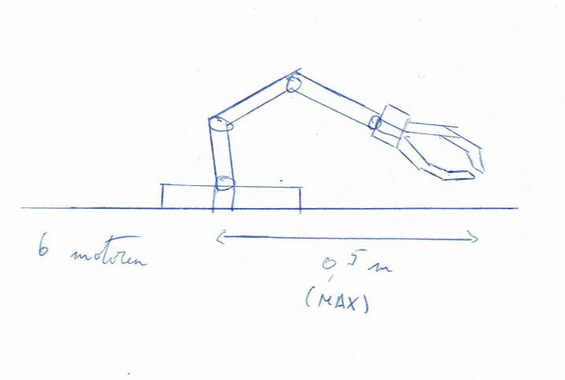
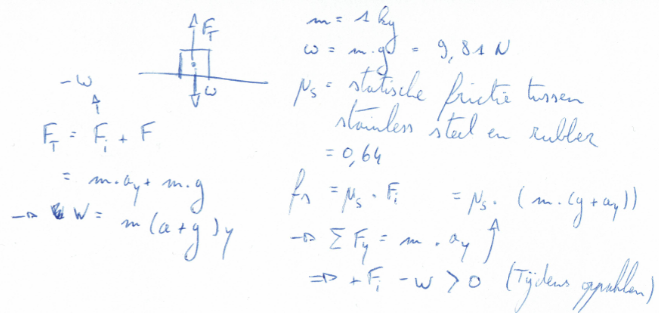

# Smart System - Hololens Robotarm

## Summary
Voor dit project zijn verschillende zaken en objecten die een belangrijke werking en functie hebben in het volledige plaatje van het project. In dit deel wordt uitgelegd wat de gedachtegang was omtrent de robotarm en hoe (én waarom) het is uitgewerkt op deze specifieke manier.
De vereisten voor de robotarm waren dat er een reikwijdte vanuit de basis was van 0,5m (vanaf heden zal naar dit als de restricted enveloppe worden verwezen)) en dat er dan nog steeds een voorwerp van 1 kilogram kon worden opgetild en verzet worden. Voor de aandrijving van de stepper motoren werken we met een raspberry pi en een specifieke shield voor deze motoren.

Allereerst is er onderzoek gedaan naar de verschillende soorten robotarmen die er bestaan, de materialen die er tot onze beschikking werden gesteld en de materialen die we eventueel zelf moesten voorzien/3D printen.

Na dit onderzoek is besloten om een Articulated design voor de robotarm toe te passen met 3 gewrichten en een end-effector met 2 vingers (een end-effector is het uiteinde van de arm waarmee objecten kunnen worden vastgenomen). Er is ook gekozen voor het type gripper voor de end-effector, aangezien andere mogelijkheden niet mogelijk waren wegens te moeilijk/kostelijk. De keuze voor de gripper en 2 vingers geeft ook de meeste opties met betrekking tot het vastgrijpen van verschillende formaten van objecten (denk hierbij aan grote langwerpige objecten die met 4 vingers moeilijk tot onmogelijk vast te grijpen zijn, …).

Op de schets valt te zien naar wat voor type arm er gestreefd zou worden. Aangezien dit een eerste, snelle en ruwe schets was is er uiteraard niet veel aandacht gegaan naar het design en de hoe en wat van de arm. De materialen stonden op dit moment nog niet 100% vast namelijk.
Het maken van een 3D schets is hierna gestart in Autodesk Fusion360. Er is gekozen voor Fusion360 doordat bleek dat dit bij uitstek geschikt was voor het designen van een robotarm en er hier ook veel tutorials over te vinden waren op het internet, wat het leerproces weer vergemakkelijkte. 

Als stepper motor werd ons de Wantai Stepper Motor 42BYGHM809 aangeboden. Deze stepper motor is van het type nema 17, wat simpelweg de grootte van deze motor weergeeft. Er is ook een datasheet van de stepper motor bijgevoegd in deze repository. Voor het testen van de robot hebben we gebruik gemaakt van de shield en de buffer board, voor de raspberry pi, die ons werd aangeboden door de school. Dit testen van de motoren wordt gedaan zodat na kan worden gegaan wat de maximale kracht is van de stepper motoren. Dit kan dan meegenomen worden in de krachtberekeningen en het design van de robotarm.

Elke component is dan nagemaakt of gedesigned in Fusion360 om op deze manier een compleet beeld te kunnen geven van de volledige robotarm en zijn afmetingen. De componenten zijn gecombineerd in 1 bestand dat dan de volledige robotarm voorstelt. Uiteraard zijn de componenten ook los te bekijken, maar de robotarm is ook volledig in zijn geheel zichtbaar.

## De vereisten
* De arm moet een reikwijdte hebben van 0,5m (straal).
* De arm moet een object van 1kg kunnen optillen op 0,5m afstand.

## De keuze van de arm

Voordat er gekozen kon worden wat het type robotarm zou worden moest er eerst gekeken worden naar de verschillende mogelijkheden. Deze staan hieronder, kort, uitgelegd:
* **Articulated:** Een armdesign dat bestaat uit 2 of meer (max 10) gewrichten. De arm is verbonden met de basis m.b.v. een draaiend gewricht en de verbinding tussen de verschillende "statische" delen gebeurt ook met deze gewrichten. Elk gewricht wordt gezien als een eigen as, dus hoe meer gewrichten, des te meer assen er gaan zijn. Elke as geeft meer vrijheden of bewegingsmogelijkheden. Meestal zijn er 4 tot 6 assen.
* **Cartesiaans:** Ook wel rectalineaire of gantry robots genoemd. Ze hebben 3 lineaire gewrichten die het cartesiaanse coördinatenstelsel (x, y en z) gebruiken. Ze kunnen ook een extra gewricht (pols in dit geval) voor rotatie gerelateerde bewegingen. De 3 prismatische gewrichten leveren een een lineaire bewegingen langs de as.
* **Cylindrisch:** De robot heeft minstens 1 draaibaar gewricht op de basis en 3 prismatische gewrichten om de verschillende "statische" delen te verbinden. Het rotatie gewricht beweegt over de gewrichtsas terwijl de prismatische gewrichten langs gewrichtsas in een lineaire beweging bewegen. Ze opereren in een cylindrische omgeving.
* **Polair:** Ook wel spherische robots genoemd, in deze configuratie is de arm verbonden met de basis d.m.v. een draaiend gewricht, een combinatie van 2 roterende gewrichten en een lineair gewricht. De assen vormen een polair coördinatensysteel en creëren een spherische werkplek.
* **SCARA:** Meestal gebruikt in assemblage toepassingen, deze selectieve en toegevende arm voor assemblage is vooral cylindrisch in design. Het bevat 2 parallelle gewrichten die meegaandheid voorzien in een geselecteerd paneel.
* **Delta:** Spinachtige robot die gebouwd is uit verbonden parallellogrammen die verbonden zijn aan een gezamenlijke basis. De parallellogrammen bewegen een enkele "end of arm tooling (EOAT)" in een koepelvormige werkplek. Veelgebruikt in de voedsel, farmaceutische en elektronische industrieën. Deze robot kan heel precieze en delicate bewegingen uitvoeren.

Uiteindelijk is gekozen voor het Articulated design, dit omdat hier de meeste voorbeelden van te vinden waren en we hierdoor de kans hadden software van de vorige robotarm te hergebruiken in verband met de servo-aansturingen.

## End effector
*De end effector is in feite de "hand" van de robotarm.*

Voor de end effector is gekozen voor een hand van het type gripper. Dit door het beperkte budget en de mogelijkheid voor gebruik in veel omstandigheden.
End effectors van dit type kunnen meerdere vingers hebben (de uiteinden waarmee de objecten worden vastgehouden). We hebben ervoor gekozen om gebruik te maken van 2 vingers, dit door de mogelijkheid om dan objecten van variabele groottes vast te pakken zonder extra moeilijkheden (een balk van oneven lengten oppakken met 4 vingers is moeilijker dan met 2 vingers).

## De arm die wij gaan gebruiken
We gaan voor een articulated design van de robotarm zelf. Dit komt het beste uit m.b.t. de servo-motoren (?types moeten nog opgezocht worden!) en de vele bewegingen die moeten worden uitgevoerd door de arm. 

Voor de end effector zouden we kunnen gaan voor een hand met 2 vingers, dit wordt in de meeste industriële toepassingen het meest gebruikt.

Er zullen 6 servos worden gebruikt:
* 1 voor de horizontale rotatie van de arm
* 3 voor de 3 verticaal beweegbare delen van de arm te besturen, ieders op een gewricht geplaatst
* 1 voor de rotatie van de end effector, deze moet ook kunnen meedraaien voor wanneer het doel object "scheef" zou taan t.o.v. de arm.
* 1 voor de vingers van de end effector te doen openen en dichtdoen.

De robotarm zal geprint worden met behulp van een 3D printer, het plastic materiaal dat we hiervoor gebruiken moet nog beslist worden in overeenkomst met wat AP hogeschool te bieden heeft.
We kunnen gebruik maken van:
* PLA: voor de eerste prototypes (de hand die op de huidige robot komt) gebruiken we PLA. Een natuurlijk polymeer dat biologisch afbreekbaar is. Hoge modulus en hoge sterkte. In amorfe toestand zacht boven ca. 55 °C, maar indien semi-kristallijn bruikbaar tot hogere temperatuur. Rek bij breuk vrij laag, maar afhankelijk van MW.
* ABS: Het materiaal is mechanisch sterk waardoor je je geen zorgen hoeft te maken over de levensduur van jouw 3D geprinte model. Niet biologisch afbreekbaar en heeft een specifieke manier van voorbereiden nodig wanneer het wordt gebruikt voor 3D printen. Zal gebruikt worden voor de uiteindelijk robotarm.

**Concreet zal de arm dus bestaan uit:**
* 3 gewrichten verbonden aan elkaar, aan 1 zijde aan het rotatievlak en aan de andere zijde verbonden met de end effector.
* 6 servos (zoals reeds eerder vermeld).

### Servo's die gebruikt zullen worden:
We gebruiken de Wantai Stepper Motor 42BYGHM809.
*Datasheet bijgevoegd in deze map.*

**Specificaties**
* +/-5% step accuracy
* Ambient temperature range 20 - 50°C
* Insulation resistance 100 mega Ohm min 50V DC
* Step angle: 0,9°
* 400 steps/revolution (400 stappen per revolutie)
* Voltage rating 2,7V
* Current rating 1,68A
* Inductance: 3,5 mH per coil
* Temperature rise tolerance: 80°C
* Holding torque: 4200 g*cm ====//==== 48N.cm volgens https://www.sparkfun.com/products/10846 
* Detent torque: 260 g*cm
* Number of leads: 4 (rood, blauw, groen en zwart)
* Motor length: 4,8cm
* Nema 17 form factor
* Weight 340g

De servo kan dus wanneer er geen stroom geleverd wordt een object in stilstand houden aan een kracht van 260 g*cm s. De maximale torque wanneer er stroom geleverd wordt, en dus de servo de mogelijkheid heeft om het object stil te houden, is gelijk aan 4200 g*cm.

### Krachtsberekeningen
#### Oppakken van het object
Voor de berekeningen omtrent de kracht die nodig is voor het opheffen van het object maken we gebruik van de volgende formules en gegevens:

De µ(s) heeft geen eenheid, deze waarde is proefondervindelijk vastgelegd.
De maximale massa is 1kg, deze waarde is dan uiteraard al ingevuld om te kunnen gebruiken bij de bepaling van het gewicht.
g is de valversnelling (niet voor een specifieke plaats, gewoon de algemene voor de aarde).

Voor de totale formule omtrent de kracht komen we uit bij:
* F = ((m * a)/(µ * n))
Waarbij:
* F de kracht van de grip op het object is
* m de massa van het object (dus maximaal 1kg)
* a de versnelling van het object
* µ de coëfficiënt van de frictie tussen het object en de rubber (DIT VERSCHILT PER OBJECT, IN DIT VOORBEELD IS ROESTVRIJ STAAL GENOMEN)
* n is het aantal vingers van de grijphand (in ons geval dus 2)

Echter kan deze formule beter geschreven worden door de versnelling van het object en de valversnelling apart neer te schrijven:
F = ((m * (a + g))/(µ * n))
Dit valt evenwaar ook te zien op het fomuleblad. De reden dat we dit doen is dat aangezien de valversnelling een evenredige tegenreactie opwerkt (wanneer het object op de plaat staat) we de totale versnelling moeten onderverdelen in deze "constante" versnelling (tegen de valversnelling in) en de niet constante versnelling (die wordt opgewekt door het bewegen van de robotarm).

Vooralsnog is de versnelling een onbekende in de berekeningen. 

#### De berekening van tandwielratio's

## Woordenboek
Bereik (in degrees of freedom):

Er zijn 3 verschillende fasen bij deze degrees of freedom:
* Maximum enveloppe: De maximale bewegingsradius van de robotarm.
* Restricted enveloppe: De bewegingsradius die door het programma dat op de robotarm staat zal worden gebruikt.
* Operating enveloppe: De zone waar de robotarm zich in een specifieke momentopname in bevindt.

## Bronvermelding
* https://blog.robotiq.com/bid/72863/End-Effector-Gripping-Strategies 
* https://en.wikipedia.org/wiki/Robot_end_effector